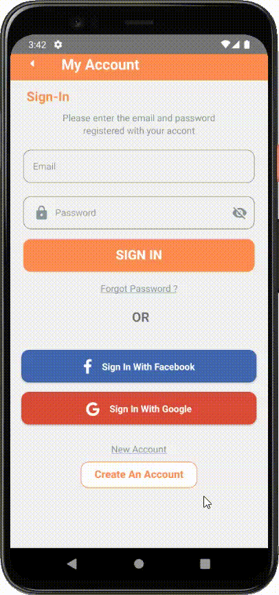

# foodApp

## 🌐 Socials:
 

   

 

# Mobile App Development with React Native

* React Native is a JavaScript library created by Facebook and used for developing native applications on mobile platforms such as iOS and Android.
In this project, I developed a "small" mobile app using React Native.

# Project Purpose
* The purpose of the project was to gain knowledge about the mobile app development process and improve myself in this field.
I covered some basic topics encountered in the mobile app development process using React Native.

# Project Details
* The project consists of several screens, including Create Account Screen, Forgot Password Screen, HomePage Screen, SignIn Screen, and SignIn Welcome Screen.
During the creation of the project, I used the React Navigation library to manage the project and navigate between screens.
Additionally, I wanted to enrich the project using various packages such as React Native Vector Icons, React Native Swiper, React Native Screens, React Native Safe Area Context, React Native Elements, and React Native Animatable.

# What I Learned
* During the project, I learned how to navigate between screens, integrate styles as a single parameter into other pages, add images as URI and require, use animations and how they impact users, understand how the Header, Footer, and Content work, and how to create and connect the src & components structure.
I used the useState() Hook to keep track of changes in component states, the useEffect() Hook to perform functions in component lifecycles, the useContext() Hook to manage accessible states, and the useRef() Hook to reference a DOM or another component.
I also used Regex syntax to support text editors.

# Challenges and Future Goals
* During the project, I faced some challenges. However, I researched resources and read documentation to overcome them and learned many things.
  In the future, I aim to develop more complex mobile applications and gain more knowledge about React Native.

  * In conclusion, I find the mobile app development process with React Native enjoyable, and this project helped me improve myself in this field.
  For beginners, creating a simple application like this project can help you learn how to develop applications using React Native.
  Additionally, you can enrich your application using various tools like the libraries I used in this project.

   

  

